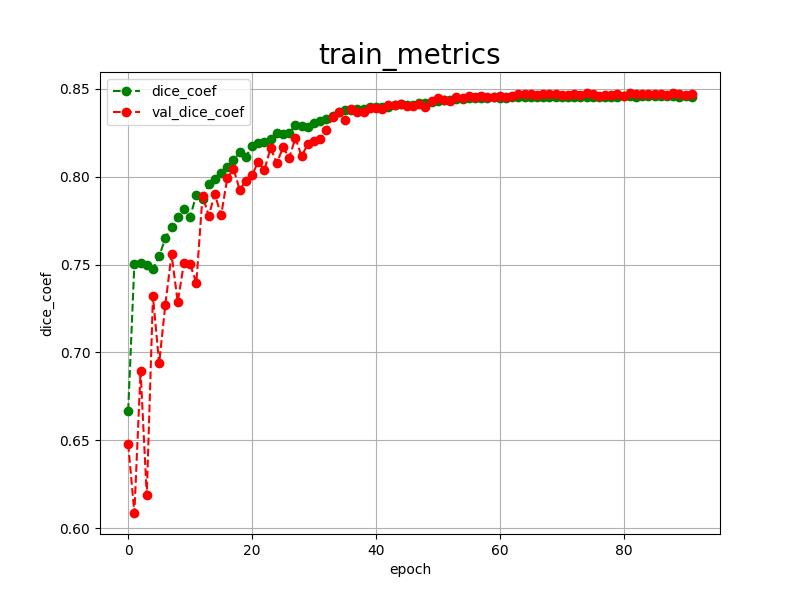
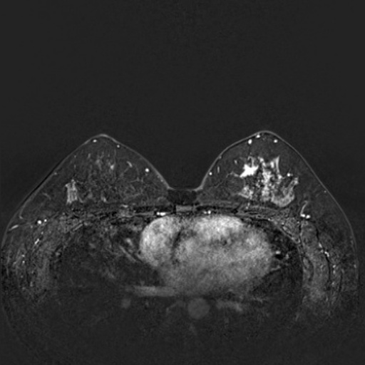

<h2>Tensorflow-Image-Segmentation-Malignant-BreastDM (2024/11/18)</h2>

This is the first experiment of Image Segmentation for Malignant Breast Cancer Cell
 based on 
the latest <a href="https://github.com/sarah-antillia/Tensorflow-Image-Segmentation-API">Tensorflow-Image-Segmentation-API</a>, and
 <a href="https://drive.google.com/file/d/10ELB1n-yXDI3aKLauZvwLkSjPVvbWm2q/view?usp=sharing">
Malignant-Malignant-BreastDM-ImageMask-Dataset.zip</a>, which was derived by us from  
<a href="https://drive.google.com/file/d/1GvNwL4iPcB2GRdK2n353bKiKV_Vnx7Qg/view">
BreaDM.zip
</a>
  
On BreaDM.zip dataset, please see also:<a href="https://github.com/smallboy-code/Breast-cancer-dataset">Breast-cancer-dataset</a> 

 

<b>Actual Image Segmentation for Images of 512x512 pixels</b> 
As shown below, the inferred masks look similar to the ground truth masks.  

<table>
<tr>
<th>Input: image</th>
<th>Mask (ground_truth)</th>
<th>Prediction: inferred_mask</th>
</tr>
<tr>
<td></td>
<td></td>
<td></td>
</tr>

<tr>
<td></td>
<td></td>
<td></td>
</tr>

<tr>
<td></td>
<td></td>
<td></td>
</tr>
</table>

 
In this experiment, we used the simple UNet Model 
<a href="./src/TensorflowUNet.py">TensorflowSlightlyFlexibleUNet</a> for this Malignant-BreastDMSegmentation Model. 
As shown in <a href="https://github.com/sarah-antillia/Tensorflow-Image-Segmentation-API">Tensorflow-Image-Segmentation-API</a>.
you may try other Tensorflow UNet Models: 

<li><a href="./src/TensorflowSwinUNet.py">TensorflowSwinUNet.py</a></li>
<li><a href="./src/TensorflowMultiResUNet.py">TensorflowMultiResUNet.py</a></li>
<li><a href="./src/TensorflowAttentionUNet.py">TensorflowAttentionUNet.py</a></li>
<li><a href="./src/TensorflowEfficientUNet.py">TensorflowEfficientUNet.py</a></li>
<li><a href="./src/TensorflowUNet3Plus.py">TensorflowUNet3Plus.py</a></li>
<li><a href="./src/TensorflowDeepLabV3Plus.py">TensorflowDeepLabV3Plus.py</a></li>

 

<h3>1. Dataset Citation</h3>
The dataset used here has been taken from the google 
<a href="https://drive.google.com/file/d/1GvNwL4iPcB2GRdK2n353bKiKV_Vnx7Qg/view">
BreaDM.zip
</a>  
On BreastDM dataset, please refer to
<a href="https://www.sciencedirect.com/science/article/abs/pii/S0010482523007205">
 BreastDM: A DCE-MRI dataset for breast tumor image segmentation and classification</b>
</a> 
Xiaoming Zhao, Yuehui Liao, Jiahao Xie, Xiaxia He, Shiqing Zhang, Guoyu Wang  , Jiangxiong Fang
, Hongsheng Lu, Jun Yu  

<a href="https://doi.org/10.1016/j.compbiomed.2023.107255">https://doi.org/10.1016/j.compbiomed.2023.107255</a> 

 
<h3>
<a id="2">
2 Malignant-BreastDM ImageMask Dataset
</a>
</h3>
 If you would like to train this Malignant-BreastDM Segmentation model by yourself,
 please download the dataset from the google drive  
<a href="https://drive.google.com/file/d/10ELB1n-yXDI3aKLauZvwLkSjPVvbWm2q/view?usp=sharing">
Malignant-Malignant-BreastDM-ImageMask-Dataset.zip</a>,
, expand the downloaded ImageMaskDataset and put it under <b>./dataset</b> folder to be
<pre>
./dataset
└─Malignant-BreastDM
    ├─test
    │   ├─images
    │   └─masks
    ├─train
    │   ├─images
    │   └─masks
    └─valid
        ├─images
        └─masks
</pre>
On the derivation of this dataset, please refer to
<a href="./projects/TensorflowSlightlyFlexibleUNet/Malignant-BreastDM/generator/TrainMalignantImageMaskDatasetGenerator.py">
TrainMalignantImageMaskDatasetGenerator.py
</a>, and <a href="./projects/TensorflowSlightlyFlexibleUNet/Malignant-BreastDM/generator/split_master.py"
</a>split_master.py.</a> 

This is a small subset of the train malignant dataset of the BreastDM. 
 
<b>Malignant-BreastDM Statistics</b> 
 
 
As shown above, the number of images of train and valid datasets is not enough to use for a training set of our segmentation model.
 
 
<b>Train_images_Ssample</b> 

 
<b>Train_masks_sample</b> 

 

<h3>
3 Train TensorflowUNet Model
</h3>
 We have trained Malignant-BreastDMTensorflowUNet Model by using the following
<a href="./projects/TensorflowSlightlyFlexibleUNet/Malignant-BreastDM/train_eval_infer.config"> <b>train_eval_infer.config</b></a> file.  
Please move to ./projects/TensorflowSlightlyFlexibleUNet/Malignant-BreastDMand run the following bat file. 
<pre>
>1.train.bat
</pre>
, which simply runs the following command. 
<pre>
>python ../../../src/TensorflowUNetTrainer.py ./train_eval_infer.config
</pre>

<b>Model parameters</b> 
Defined a small <b>base_filters</b> and large <b>base_kernels</b> for the first Conv Layer of Encoder Block of 
<a href="./src/TensorflowUNet.py">TensorflowUNet.py</a> 
and a large num_layers (including a bridge between Encoder and Decoder Blocks).
<pre>
[model]
base_filters   = 16
base_kernels   = (7,7)
num_layers     = 8
dilation       = (1,1)
</pre>

<b>Learning rate</b> 
Defined a small learning rate.  
<pre>
[model]
learning_rate  = 0.0001
</pre>

<b>Online augmentation</b> 
Disabled our online augmentation.  
<pre>
[model]
model         = "TensorflowUNet"
generator     = False
</pre>

<b>Loss and metrics functions</b> 
Specified "bce_dice_loss" and "dice_coef". 
<pre>
[model]
loss           = "bce_dice_loss"
metrics        = ["dice_coef"]
</pre>
<b>Learning rate reducer callback</b> 
Enabled learing_rate_reducer callback, and a small reducer_patience.
<pre> 
[train]
learning_rate_reducer = True
reducer_factor     = 0.4
reducer_patience   = 4
</pre>

<b>Early stopping callback</b> 
Enabled early stopping callback with patience parameter.
<pre>
[train]
patience      = 10
</pre>

<b>Epoch change inference callbacks</b> 
Enabled epoch_change_infer callback. 
<pre>
[train]
epoch_change_infer       = True
epoch_change_infer_dir   =  "./epoch_change_infer"
epoch_changeinfer        = False
epoch_changeinfer_dir    = "./epoch_changeinfer"
num_infer_images         = 6
</pre>

By using this callback, on every epoch_change, the inference procedure can be called
 for 6 images in <b>mini_test</b> folder. This will help you confirm how the predicted mask changes 
 at each epoch during your training process.    

<b>Epoch_change_inference output</b> 
 
 

In this experiment, the training process was stopped at epoch 92  by EarlyStopping Callback.  
 
 

<a href="./projects/TensorflowSlightlyFlexibleUNet/Malignant-BreastDM/eval/train_metrics.csv">train_metrics.csv</a> 
 

 
<a href="./projects/TensorflowSlightlyFlexibleUNet/Malignant-BreastDM/eval/train_losses.csv">train_losses.csv</a> 
 

 

<h3>
4 Evaluation
</h3>
Please move to a <b>./projects/TensorflowSlightlyFlexibleUNet/Malignant-BreastDM</b> folder, 
and run the following bat file to evaluate TensorflowUNet model for Malignant-BreastDM. 
<pre>
./2.evaluate.bat
</pre>
This bat file simply runs the following command.
<pre>
python ../../../src/TensorflowUNetEvaluator.py ./train_eval_infer_aug.config
</pre>

Evaluation console output: 

  Image-Segmentation-Malignant-BreastDM

<a href="./projects/TensorflowSlightlyFlexibleUNet/Malignant-BreastDM/evaluation.csv">evaluation.csv</a> 

The loss (bce_dice_loss) to this Malignant-BreastDM/test was low, but dice_coef not so high as shown below.
 
<pre>
loss,0.0803
dice_coef,0.8444
</pre>
 

<h3>
5 Inference
</h3>
Please move to a <b>./projects/TensorflowSlightlyFlexibleUNet/Malignant-BreastDM</b> folder 
,and run the following bat file to infer segmentation regions for images by the Trained-TensorflowUNet model for Malignant-BreastDM. 
<pre>
./3.infer.bat
</pre>
This simply runs the following command.
<pre>
python ../../../src/TensorflowUNetInferencer.py ./train_eval_infer_aug.config
</pre>

<b>mini_test_images</b> 
 
<b>mini_test_mask(ground_truth)</b> 
 

<b>Inferred test masks</b> 
 
 

<b>Enlarged images and masks </b> 

<table>
<tr>
<th>Image</th>
<th>Mask (ground_truth)</th>
<th>Inferred-mask</th>
</tr>

<tr>
<td></td>
<td></td>
<td></td>
</tr>

<tr>
<td></td>
<td></td>
<td></td>
</tr>

<tr>
<td></td>
<td></td>
<td></td>
</tr>
<tr>
<td></td>
<td></td>
<td></td>
</tr>
<tr>
<td></td>
<td></td>
<td></td>
</tr>
<tr>
<td></td>
<td></td>
<td></td>
</tr>
</table>

 

<h3>
References
</h3>
<b>1. BreastDM: A DCE-MRI dataset for breast tumor image segmentation and classification</b> 
Xiaoming Zhao, Yuehui Liao, Jiahao Xie, Xiaxia He, Shiqing Zhang, Guoyu Wang  , Jiangxiong Fang
, Hongsheng Lu, Jun Yu  
 
<a href="https://doi.org/10.1016/j.compbiomed.2023.107255">https://doi.org/10.1016/j.compbiomed.2023.107255</a> 
<a href="https://www.sciencedirect.com/science/article/abs/pii/S0010482523007205">
https://www.sciencedirect.com/science/article/abs/pii/S0010482523007205</a>

 

